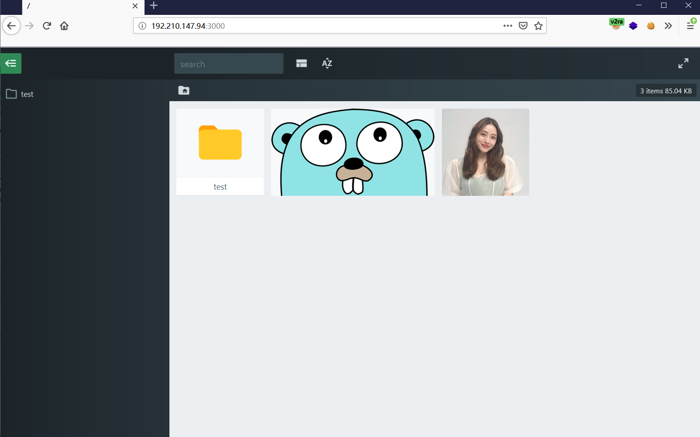
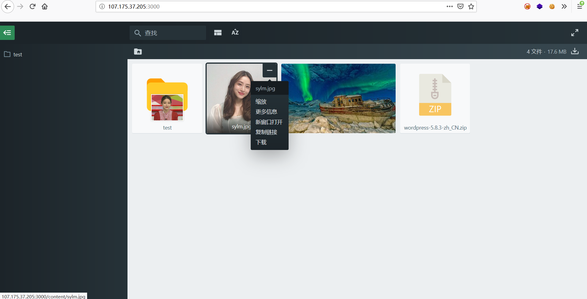
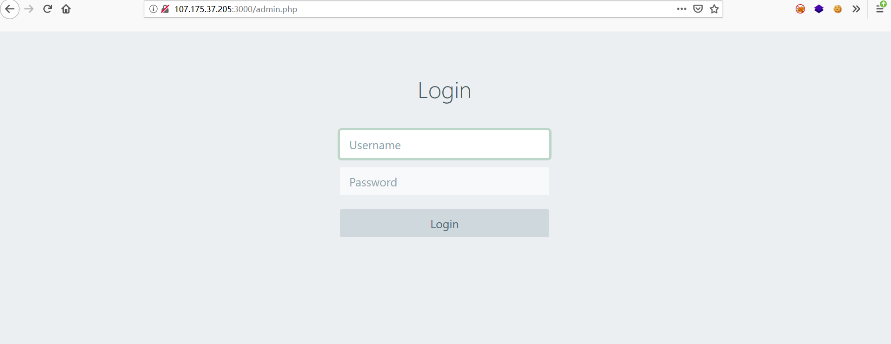
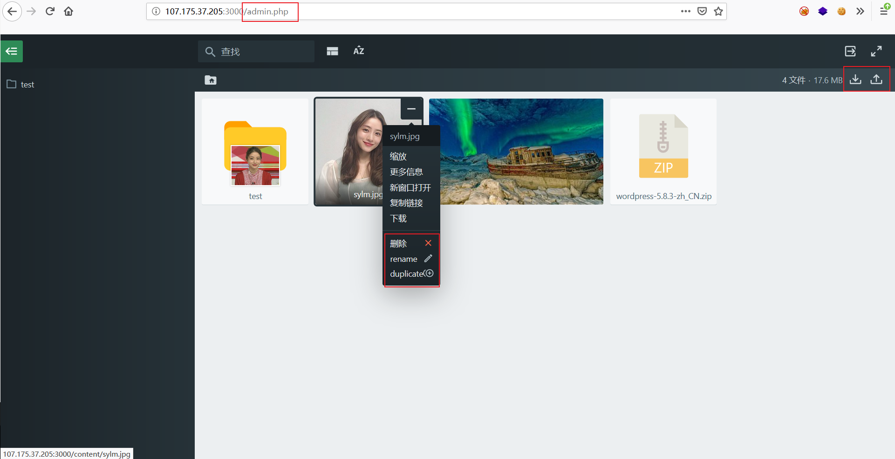

# Files

The project provides a docker image for Files App(files.photo.gallery).


<p align="center">
English | <a href="README.zh-CN.md">中文</a>
</p>


### Introduction

For the purpose of learning,I replace the `files.js` with cracked version which just remove authorization code.

So you can run this image directly to display your files.

Please support the original if you could.


### usage

you can just run:

```
docker run -d --name files -v /root/content:/var/www/html/content -p 3000:80 cjy0526/files:v1
```





If you want to build image yourself,please clone the project and run:

```
docker build -t files:v1 .

docker run -d --name files -v /root/content:/var/www/html/content -p 3000:80 files:v1
```


### 0.3.1 update

Files 0.3.1 can upload/delete/rename/new file and folder  and download files as zip

In our docker container , you can login fileadmin.php to manage files. Default username:fileadmin , password: fileadmin ,  max upload file size: 5000M.








```
docker run -d --name files -v /root/content:/var/www/html/content -p 3000:80 cjy0526/files:v2
```


If you want to change username or password or max upload file size, just clone this project and edit Dockerfile then build image yourself.


